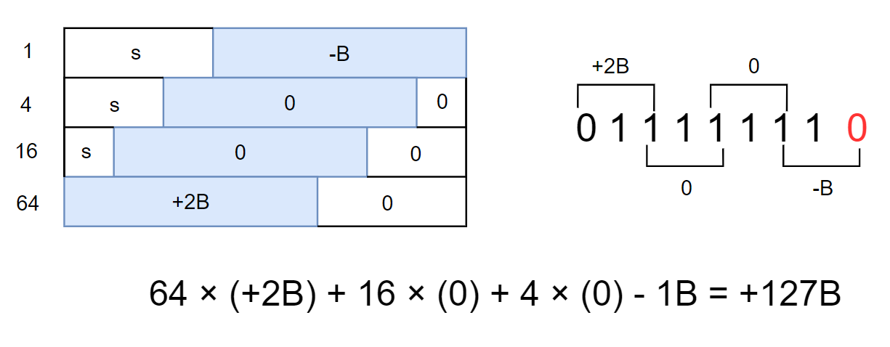
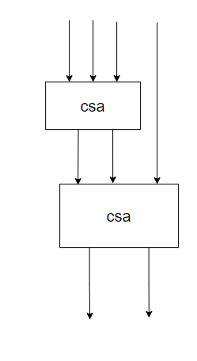

### 摘要

结合Radix-4的Booth编码和Wallace树两种技术设计了一个32×32的有符号乘法器。其运算过程可以概括为三个步骤：

1. 部分积生成：对其中一个乘数做Booth编码，产生一系列的编码结果。然后另一个乘数根据这些编码结果产生部分积。该步骤结束后会产生16个部分积
2. 部分积压缩：使用树形结构的4-2压缩器，不断对部分积进行压缩。
3. 最终求和：当把部分积的个数压缩到只剩下两个的时候，使用一个加法器来进行最终的求和，产生的即是乘法结果

### Booth算法介绍：

Booth算法是一种用来减少部分积项数的算法，根据采用基底的不同可以划分出很多版本，但本质思路不变。采用越高的基底，对部分积的压缩效果会越明显，但是对于编码结果的处理也会越复杂，这之间存在一个取舍。此处展示的是Radix-4版本

#### 基本原理

##### 通俗版本：

**任何一串连续的二进制1都可以被分解为两个二进制1的加减**。例如01111 = 10000 - 00001。算法在做的事情可以理解为就是在识别这样的一串1

##### 严肃版本：

对于一个以 n位二进制补码形式表示的乘数`A`，其值为:
$$
A=A_{n-1} \times (-2^{n-1})+\sum_{i=0}^{n-2}A_i \times 2^i \tag{1}
$$
式(1)中， A~i~代表数据`A`的第i位的值。本设计中乘法器输入的乘数 `A`是32位的，代入式(1)，则可以表示为
$$
\begin{align}
A&= -A_{31}2^{31}+A_{30}2^{30}+A_{29}2^{29} \cdots +A_{0}2^{0} \\
&= (-2A_{31}+A_{30}+A_{29})2^{30} + (-2A_{29}+A_{28}+A_{27})2^{28}+ \cdots + (-2A_{1}+A_{0}+A_{-1})2^{0}\tag{2}
\end{align}
$$
为了保持结构的规整性加入了一项A~-1~，其在数值上恒等于0。将其中一个乘数数据的相邻的三位 $\{A~i+1~，A~i~，A~i-1~ \}$视为一个整体，则(2)式与(1)式相比，2的幂次项从32个减少到16个，从而`A`与`B`相乘后的部分积项数也可以从32个减少到16个，减少了后续为处理部分积的电路资源开销。

Radix-4 Booth编码与所对应的部分积操作之间的对应关系如表1所示，从表中可知，Radix-4 Booth编码方案中部分积操作数一共有五类，即`0`、`+B`、`+2B`、`-B`、`-2B`。其中，`0`是确定数 ，`+B`就是乘法器的输入，`+2B`直接由输入的`+B`数据左移一位得到，这些数据都是现有的。而对于`-B`、`-2B`的生成，将`-B`左移一位即可得到`-2B`，需要通过电路资源额外生成一个`-B`操作数。

表1. Radix-4 Booth乘数编码与部分积操作对照表

$$
\begin{array}{|c|c|c|}
\hline
{\{A_{i+1},A_{i},A_{i-1}\}}&{-2A_{i+1}+A_{i}+A_{i-1}}&{部分积操作}\\
\hline
{000}&{0}&{0}\\
\hline
{001}&{+1}&{B}\\
\hline
{010}&{+1}&{B}\\
\hline
{011}&{+2}&{2B}\\
\hline
{100}&{-2}&{-2B}\\
\hline
{101}&{-1}&{-B}\\
\hline
{110}&{-1}&{-B}\\
\hline
{111}&{0}&{0}\\
\hline
\end{array}
$$

举例来说，当A = 16'b01111111时，对其做booth编码将得到以下结果：

不过注意要对生成的部分积做移位和符号扩展。

### wallace乘法器介绍

是一种把压缩器件按照树形结构排列，不断减少部分积的个数，最终将部分积的数量减少到两个的乘法器结构。常见的压缩器件有3-2压缩的csa和4-2压缩器、5-2压缩器。这里不宜采用2-1的普通加法器，因为它需要考虑进位链问题，带来较大延迟

### 设计详解：

A用于参加booth编码，B用于生成部分积。由于该设计中结构的重复性很明显，每层都可以借助generate语句来方便模块的实例化

#### booth编码器模块(b0~b15)

把A的相应比特传递给编码器，然后每个编码器会根据表1来输出一个编码结果。该层比较简单，注意正确设置每个booth编码器的输入即可

#### ppg模块(ppg0~ppg15)

根据b的值和booth编码器的输出结果，生成一个部分积。同时要负责对部分积做符号扩展和移位。

该层的注意事项是：虽然这是32位乘法，但需要至少34位来保存中间结果。因为当输入的B=0x80000000时（最小的负数），此时用32位将会无法表示-B与-2B。

并且由于ppg模块内部会用到-B这个数，为了避免每个模块都生成一份-B，我会一开始的时候先在模块外部先生成一个-B，然后统一把它传递给每个ppg模块的输入端。不过这在画的结构图中没有体现，主要是为了看起来清爽一些

#### 4-2压缩器模块(compressor42)

3-2压缩的csa比较容易理解，4-2压缩器则复杂一些。我这里用到的是一种比较简单的实现：使用两个csa，第一个csa负责把四个部分积转化成3个，第二个csa进一步把3个部分积转化成2个，进而达到4-2压缩的效果

### 功能验证

采用随机数测试。在testbench中通过一个always块每周期产生两个随机数，分别赋值给乘法器的两个输入，产生一个结果。再使用verilog内置的 `*` 运算符产生另一个结果，对比两个数是否相等。如果不相等就退出仿真。一直运行该程序，发现它不会停下来。

也想到了遍历测试，但两个乘数都是32位，想遍历所有情况好像并不容易，所以没有做。
